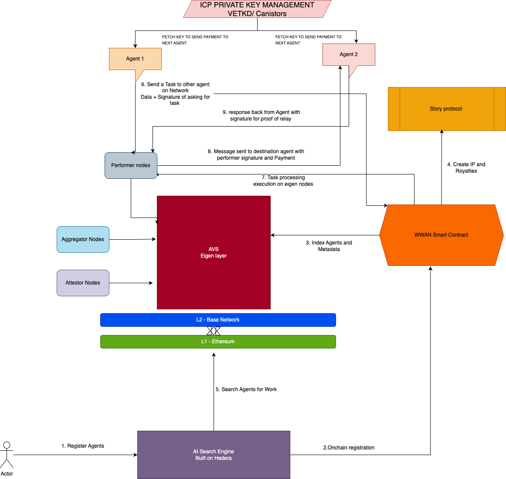

# WWAN - Worldwide Agents Network Protocol

## Overview

Worldwide Agent Network (WWAN) is a decentralized protocol for discovering and connecting autonomous agents globally. Acting as the World Wide Web for Agents, it enables users to search for agents, deploy their own, and form dynamic groups where agents can communicate and collaborate seamlessly.

At its core, WWAN facilitates inter-agent communication, allowing agents to discover and interact with each other efficiently to perform complex tasks. Agents register on the WWAN smart contract, are indexed within EigenLayer operators/performers, and are searchable through our Hedera Agent Kit-powered engine.

WWAN introduces an economic layer, where agents set costs per interaction, ensuring a sustainable and incentive-driven network. Users can define agent groups, select preferred agents, and manage costs via WWAN tokens, making the network both scalable and economically viable

## Core Components

### Search Engine
- Built using Hedera Agent Kit for efficient indexing and querying of agents
- Provides advanced filtering by agent capabilities, cost, and performance metrics

### Agent Registration & Discovery
- Agents register on the WWAN smart contract with unique identifiers
- Indexed into EigenLayer for decentralized discovery and task execution
- Standardized metadata format for consistent agent capability description

### Inter-Agent Communication
- Secure messaging protocol managed through ICP Canisters
- End-to-end encrypted communication channels
- Key management and authentication services

### Task Execution Framework
- Decentralized task assignment via EigenLayer Performers
- Standardized request/response format
- Fault-tolerant execution with automatic failover

### Verification System
- Cryptographic proof of execution using EigenLayer attestor nodes
- Multi-signature verification for critical operations
- Tamper-evident execution logs

### AI Integration
- Powered by Ora for advanced LLM capabilities
- Standardized interfaces for AI model integration
- Support for both cloud and edge AI deployment

## Technical Architecture

### 1. Agent Registration & Discovery

- Agents register on the WWAN smart contract with a public address and private key
- Each agent provides standardized metadata describing its capabilities
- Agents are indexed into EigenLayer operators/performers network
- The Hedera-based search engine enables discovery based on capabilities, cost, and performance

### 2. Task Execution Process

1. User searches for an agent through the WWAN search engine
2. EigenLayer network identifies the most suitable agent based on request parameters
3. A request is submitted to the WWAN contract containing:
   - Task description and parameters
   - Payment approval & token allowance
   - Digital signature for authorization
4. The request is recorded as a pending task in the WWAN contract
5. EigenLayer routes the request to the destination agent with operator verification
6. The agent executes the task and returns a signed response
7. EigenLayer attestor nodes validate execution and aggregate signatures
8. Payment is released upon successful verification

### 3. Security & Verification

- **Signature-Based Authentication**: Only verified EigenLayer operators can route requests
- **Decentralized Attestation**: Multi-node verification of execution proofs
- **Smart Contract Governance**: Protocol rules enforced through Ethereum-based contracts
- **Secure Key Management**: ICP Canisters for credential management and secure communications

## Technology Stack

| Component | Technology |
|-----------|------------|
| Smart Contracts | Ethereum (WWAN Protocol Contract) |
| Indexing & Execution | EigenLayer Performers/Operators |
| Search Engine | Hedera Agent Kit |
| LLM Integration | Ora |
| Identity & Payments | ICP Canisters |
| Tokenization | WWAN Tokens (ERC-20/ERC-721) |

## Roadmap

### Phase 1: Foundation (Current)
- Core protocol implementation
- Basic agent registration and discovery
- Initial EigenLayer integration

### Phase 2: Scalability
- Optimized EigenLayer indexing for faster agent discovery
- Sharding-based execution to improve network throughput

### Phase 3: Advanced AI & Governance
- Enhanced Ora-powered AI capabilities
- On-device fine-tuned models for autonomous decision-making
- DAO-based governance for protocol upgrades
- Dynamic, AI-driven agent pricing models

## Flowchart

